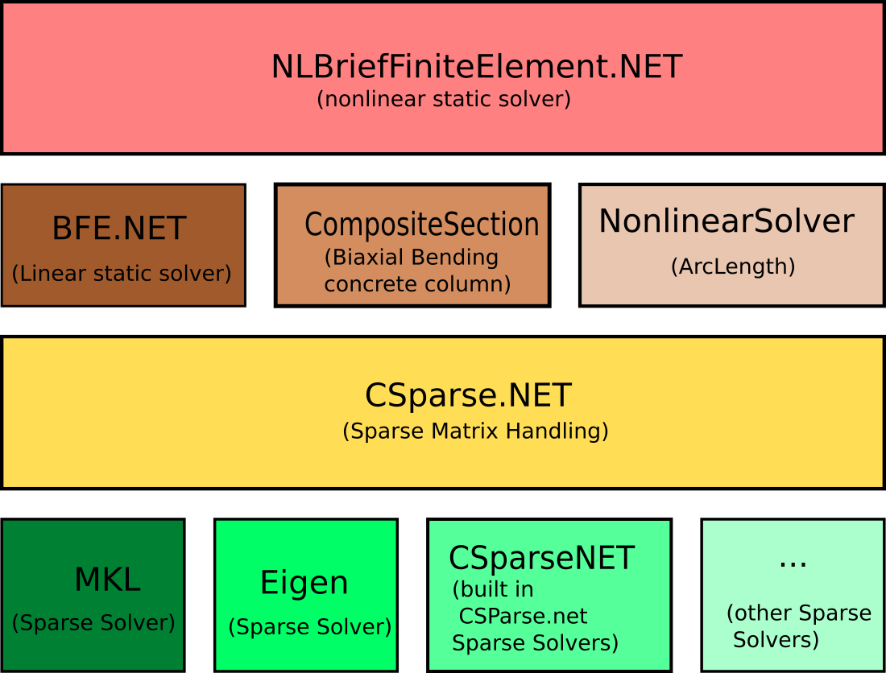

class-diagram

use here to render digram:
https://mermaid-js.github.io/mermaid-live-editor/edit

# Overal architecture

Architecture from calculation and computation aspect is intended to be layered and organized like this

NLBfe sits on top of BFE and ArcLength controller and CompositeSection. It uses arclength to generate each step as a linear model.
CompositeSection is used to find end forces of BarElements under trial diplacements.

Note that to scape from nonlinear traps will use ArcLength method along with newton raphson method. 
both BFE and ArcLength know the CSparse.NET, so there is little direct contact between NLBFE and CSparse (if any at all), most contact with CSparse is done with BFE.

To use NLBFE, user is not massively interfaced to BFE or ArcLength or CompositeSection, sort of encapsulation.

The `Csparse.NET` will handle sparse matrix stuff, like factorization and equation system solving by direct or itterative methods.
`CSparse.NET` can use well-known softwares like MKL, EIGEN etc. via CsparseExtensions repository on the github.

This layered organization is good. not only for the writer, but also to the maintainer and users. I whish i did same for BFE :)
Except top layer, other layers are done and sucessfully tested at the time. There where massive stuff with DOF renumbering etc in linear BFE, but that is done and no need to rewrite those stuff again.

