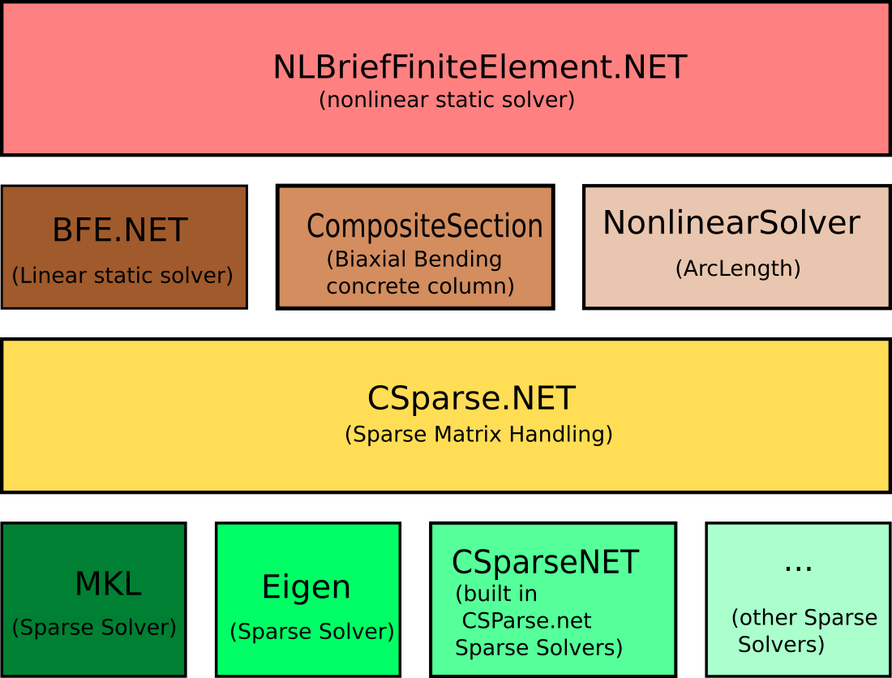

class-diagram

use here to render digram:
https://mermaid-js.github.io/mermaid-live-editor/edit

# Overal architecture

Architecture from calculation aspect is intended to be like this

NLBfe sits on top of BFE and ArcLength controller. It uses arclength to generate each step as a linear model.
Note that to scape from nonlinear traps will use ArcLength method along with newton raphson method. 
both BFE and ArcLength know the CSparse.NET, so there is little direct contact between NLBFE and CSparse, most contact with CSparse is done with BFE.

To use NLBFE, user is not interfaced to BFE or ArcLength, sort of encapsulation.

